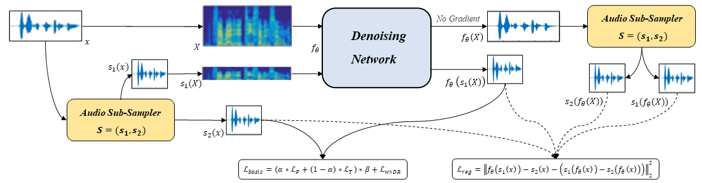
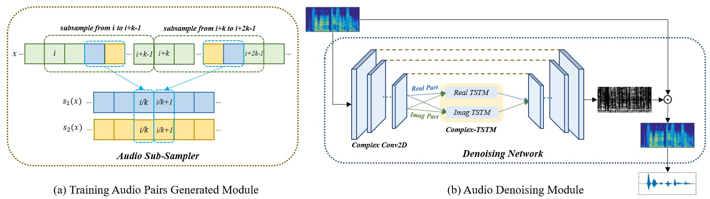

# Self-Supervised Speech Denoising Using Only Noisy Audio Signals

Source code for the paper "Self-Supervised Speech Denoising Using Only Noisy Audio Signals". In this paper, we propose a self-supervised speech denoising strategy named Only-Noisy Training (ONT), which solves the speech denoising problem with only noisy audio signals in audio space for the first time. 
- Related audio examples of signals $x$, $s_{1}(x)$, $s_{2}(x)$, $f(x)$, $f(s_{1}(x))$, $f(s_{2}(x))$ can be downloaded from the ***Audio_example*** file.




## Environment

The code is developed under the following configurations.
- Hardware: 1-4 GPUs (change gpu numbers accordingly)
- Software: ***CUDA=11.4.48, Python=3.9.5, PyTorch=1.10.0***


## Dataset

The dataset is generated by overlapping two noise categories over clean audios. The clean audios are selected from Voice Bank + DEMAND dataset (https://datashare.ed.ac.uk/handle/10283/2791). While the first noise dataset uses white gaussian to generate synthetic noisy audio dataset, the second is UrbanSound8K dataset (https://urbansounddataset.weebly.com/urbansound8k.html), which is used to generate real world noisy audio dataset. You can generate different kinds of noisy audios by running the following two scripts:
```
python whitenoise_dataset_generator.py
python urbansound_dataset_generator.py
```

## Model

The proposed ONT constructs training pairs only from each single noisy audio, and it contains two modules: training audio pairs generated module and speech de-noising module.
- The first module adopts a random audio sub-sampler on single noisy audio samples for the generation of training audio pairs. 
- The sub-sampled training audio pairs are then fed into the audio denoising module, which employs a deep complex U-Net incorporating a complex two-stage transformer (cTSTM) to extract both magnitude and phase information.

## Training

You can choose the following three models for training: ONT,ONT-rTSTM and ONT-cTSTM. ONT represents our speech denoising strategy using single noisy audio samples with a complex U-Net without TSTM; ONT-rTSTM represents our novel strategy with a real-valued TSTM (rTSTM) between the complex U-Net; ONT-cTSTM represents our novel strategy with a complex-valued TSTM (cTSTM) between the complex U-Net. You can train the model by running the following script:
```
python train.py
```
> The original raw audio waveforms are first sampled at 48kHz and then transformed by the STFT with a 64ms Hamming window and 16ms hop size to obtain complex-valued spectrograms. The length of training pairs is 1/2 times of original noisy samples. The number of two-stage transformer blocks(TSTBs) is 6. In the loss function, we set α = 0.8, β = 1/200, γ=2 in the synthetic experiments and γ=1 in the real world experiments empirically. We use Adam optimizer with a learning rate of 0.001. **You can adjust these parameters to suit different training needs.**

## Special thanks to the following repositories:
- https://github.com/madhavmk/Noise2Noise-audio_denoising_without_clean_training_data
- https://github.com/neeraj3029/Ne2Ne-Image-Denoising
- https://github.com/pheepa/DCUnet
- https://github.com/key2miao/CAUNet

## Reference
If it helps your research, please cite:
```
Jiasong Wu, Qingchun Li, Guanyu Yang, Lei Li, Lotfi Senhadji and Huazhong Shu, Self-Supervised Speech Denoising Using Only Noisy Audio Signals

```
## Contacts
- Qingchun Li: 3193891505@qq.com
- Jiasong Wu: jswu@seu.edu.cn
